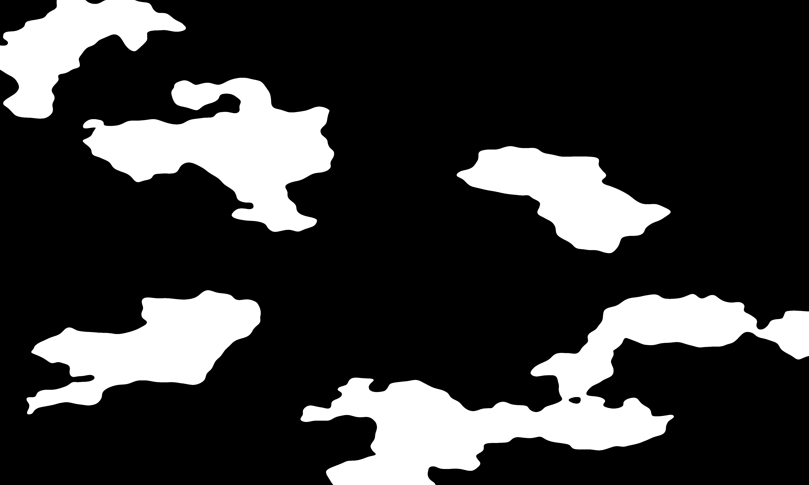
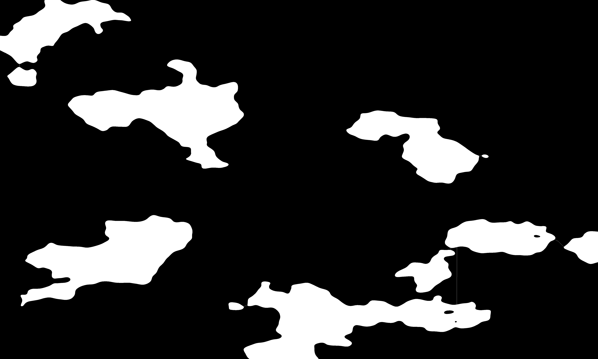

# Pixelz Computer Vision Challenge 1

##  Introduction
In the realm of computer vision, many tasks do not require AI to be performed and it is important to be aware of such cases so as to avoid spending unnecessary resources on the wrong solution idea.

This challenge is one such case. The input generator will create a binary image with connected components. It will also provide you with a label image for these connected components. And it will provide a version of the same image where the connected componenents have undergone some sort of erosion and have been split into multiple connected components.

Your task is to devise an algorithm that can link the parts of the original connected components into their original single connected component (there can still be several connected components in the result image as there were in the original image).

## Task requirements
Here is a more precise set of task requirements:
- We use 8 connected neighbors
- The split CCs must be linked by a single pixel wide curve
- While the object of the competition is not about optimization, it is still expected that the algorithm should provide reasonably good solutions in terms of the number of pixels added. Said otherwise, try to have links as short as possible (but you won't be penalized if they are not the shortest possible ones).
- You are not allowed to use hardcoded or (pre)trained variables in the solution. Comparing values with 0 to check their sign or angles with multiples of Pi/2 to check quadrant orientation in order to properly handle trigonometry functions is ok.
- Not a hard requirement but the solution should run reaonsably fast (definitely less than a minute)
on the images produced by the input generator with the default settings (3000x5000 pixels).

## About link length/quality of a solution
Here is an example of a problem:

  

Here is an example of a good solution:

  

Here is an example of a bad solution:

  

## Benchmarking/evaluation
This challenge is not about finding the best solution as some may care about different KPIs such as speed vs number of additional pixels. It is about finding a solution that meets the requirements.

Also there is no particular reward. This is a challenge "for the love of the art".

As such, and because we don't have the resources/time for it, we won't setup any automated or manual evaluation or a leaderboard. You can use the input generator to create more examples and judge by yourself of the quality of your own code.

Should you wish to discuss your solution, feel free to reach out to < competition email >
We also regularly have open positions for our R&D team in Hanoi, Vietnam. Solving this challenge is a good way to draw attention to your application. [https://www.pixelz.com/jobs/](https://www.pixelz.com/jobs/)

## Is this challenge about a real problem?

Oh yes it is! It may not look like it is but the solution to this challenge is part of an algorithm about 30 times bigger to solve some crazy automation problem that we have at Pixelz. We will roll it out soon in production and you may hear about it.